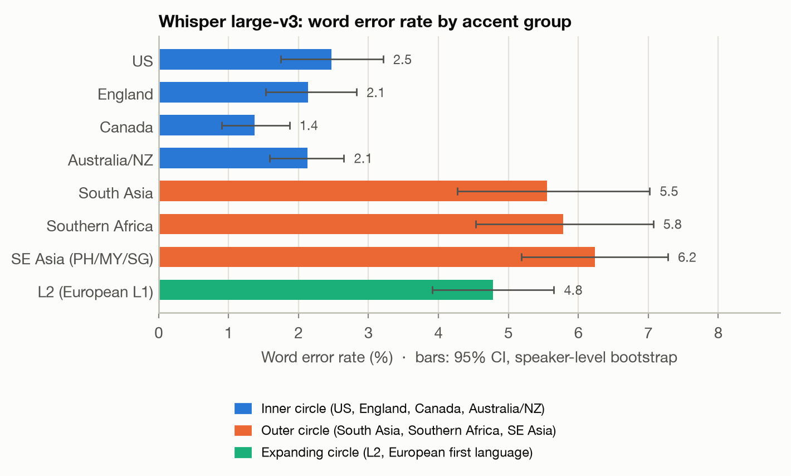
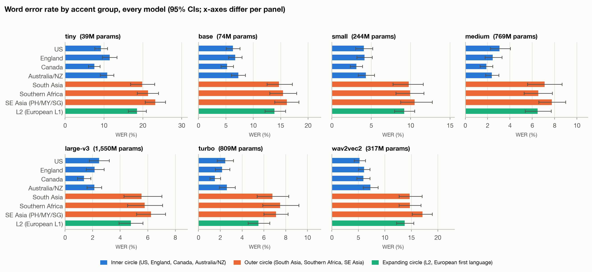
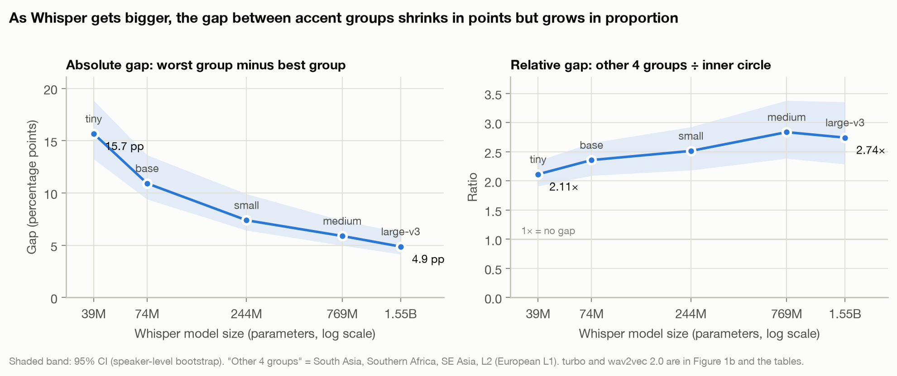
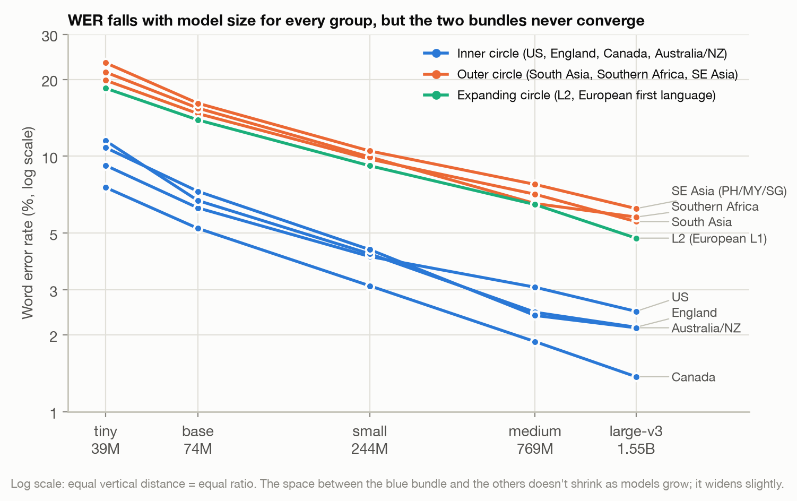

# Phase 4 results summary

_Generated by `src/analyze.py`. 95% confidence intervals from a speaker-level bootstrap (1,000 resamples). WER is pooled (total errors / total reference words)._

## WER (%) by accent group and model

|                    | tiny              | base              | small            | medium         | large-v3       | turbo          | wav2vec2          |
|:-------------------|:------------------|:------------------|:-----------------|:---------------|:---------------|:---------------|:------------------|
| US                 | 9.2 [7.6, 10.9]   | 6.3 [5.1, 7.6]    | 4.0 [3.0, 5.2]   | 3.1 [2.2, 4.0] | 2.5 [1.8, 3.2] | 2.5 [1.7, 3.2] | 5.2 [4.2, 6.3]    |
| England            | 11.5 [9.6, 13.3]  | 6.7 [5.5, 7.9]    | 4.2 [3.2, 5.1]   | 2.5 [1.8, 3.3] | 2.1 [1.5, 2.8] | 2.2 [1.5, 2.9] | 6.1 [5.0, 7.2]    |
| Canada             | 7.5 [6.0, 9.0]    | 5.2 [4.1, 6.3]    | 3.1 [2.3, 3.9]   | 1.9 [1.3, 2.5] | 1.4 [0.9, 1.9] | 1.5 [1.0, 2.0] | 6.0 [4.7, 7.2]    |
| Australia/NZ       | 10.8 [9.1, 12.5]  | 7.3 [6.0, 8.6]    | 4.3 [3.3, 5.4]   | 2.4 [1.8, 3.0] | 2.1 [1.6, 2.6] | 2.6 [1.9, 3.4] | 7.3 [5.9, 8.7]    |
| South Asia         | 19.8 [16.8, 23.0] | 14.7 [12.5, 17.1] | 9.8 [7.7, 11.6]  | 7.1 [5.6, 8.7] | 5.5 [4.3, 7.0] | 6.8 [5.4, 8.3] | 14.7 [12.7, 17.0] |
| Southern Africa    | 21.4 [18.6, 24.0] | 15.4 [13.0, 17.9] | 9.9 [8.1, 11.7]  | 6.5 [5.3, 7.8] | 5.8 [4.5, 7.1] | 7.5 [5.9, 9.2] | 14.7 [12.7, 16.8] |
| SE Asia (PH/MY/SG) | 23.2 [20.6, 25.8] | 16.1 [13.9, 18.3] | 10.5 [8.7, 12.7] | 7.8 [6.6, 9.0] | 6.2 [5.2, 7.3] | 7.1 [6.0, 8.2] | 17.1 [15.2, 18.9] |
| L2 (European L1)   | 18.5 [16.2, 20.9] | 13.9 [12.2, 15.9] | 9.2 [8.0, 10.5]  | 6.5 [5.4, 7.7] | 4.8 [3.9, 5.7] | 5.5 [4.5, 6.5] | 13.8 [12.2, 15.4] |

## Gap between groups, by model

| model    |   params_m | best         | worst                     | gap (pp)          | worst ÷ best    | other ÷ inner   |
|:---------|-----------:|:-------------|:--------------------------|:------------------|:----------------|:----------------|
| tiny     |         39 | Canada (7.6) | SE Asia (PH/MY/SG) (23.2) | 15.7 [13.2, 18.8] | 3.1× [2.6, 4.0] | 2.1× [1.9, 2.3] |
| base     |         74 | Canada (5.2) | SE Asia (PH/MY/SG) (16.1) | 10.9 [9.4, 13.6]  | 3.1× [2.6, 4.1] | 2.4× [2.1, 2.7] |
| small    |        244 | Canada (3.1) | SE Asia (PH/MY/SG) (10.5) | 7.4 [6.4, 9.9]    | 3.4× [2.8, 4.8] | 2.5× [2.2, 2.9] |
| medium   |        769 | Canada (1.9) | SE Asia (PH/MY/SG) (7.8)  | 5.9 [5.0, 7.3]    | 4.1× [3.3, 6.0] | 2.8× [2.4, 3.4] |
| large-v3 |       1550 | Canada (1.4) | SE Asia (PH/MY/SG) (6.2)  | 4.9 [4.1, 6.2]    | 4.6× [3.4, 7.6] | 2.7× [2.3, 3.4] |
| turbo    |        809 | Canada (1.5) | Southern Africa (7.5)     | 6.0 [5.1, 7.8]    | 5.0× [3.7, 8.0] | 3.1× [2.6, 3.7] |
| wav2vec2 |        317 | US (5.2)     | SE Asia (PH/MY/SG) (17.1) | 11.9 [10.0, 14.1] | 3.3× [2.7, 4.2] | 2.5× [2.2, 2.8] |

_"other ÷ inner" = pooled WER of the four outer/expanding-circle groups divided by pooled WER of the four inner-circle groups. It's steadier than worst ÷ best, which depends on just two groups._

## Each group vs. the US group (difference in percentage points)

|                    | tiny                | base              | small            | medium              | large-v3            | turbo               | wav2vec2           |
|:-------------------|:--------------------|:------------------|:-----------------|:--------------------|:--------------------|:--------------------|:-------------------|
| England            | 2.3 [-0.3, 4.9]     | 0.4 [-1.3, 2.2]   | 0.1 [-1.4, 1.6]  | -0.6 [-1.8, 0.5]    | -0.3 [-1.3, 0.7]    | -0.3 [-1.3, 0.7]    | 0.9 [-0.7, 2.5]    |
| Canada             | -1.7 [-3.8, 0.5]    | -1.1 [-2.7, 0.5]  | -0.9 [-2.3, 0.4] | -1.2 [-2.2, -0.2] * | -1.1 [-1.9, -0.2] * | -0.9 [-1.8, -0.1] * | 0.7 [-0.8, 2.3]    |
| Australia/NZ       | 1.6 [-0.7, 3.9]     | 1.0 [-0.8, 2.7]   | 0.3 [-1.2, 1.7]  | -0.7 [-1.8, 0.4]    | -0.3 [-1.3, 0.5]    | 0.2 [-0.9, 1.1]     | 2.0 [0.3, 3.8] *   |
| South Asia         | 10.6 [7.3, 14.3] *  | 8.4 [5.7, 11.2] * | 5.7 [3.5, 7.9] * | 4.0 [2.4, 5.8] *    | 3.1 [1.5, 4.8] *    | 4.3 [2.8, 6.0] *    | 9.4 [7.2, 11.9] *  |
| Southern Africa    | 12.1 [8.9, 15.2] *  | 9.2 [6.4, 12.0] * | 5.9 [3.8, 8.0] * | 3.5 [1.9, 5.0] *    | 3.3 [1.9, 4.8] *    | 5.0 [3.3, 6.9] *    | 9.5 [7.3, 11.8] *  |
| SE Asia (PH/MY/SG) | 14.0 [10.9, 17.1] * | 9.8 [7.5, 12.4] * | 6.4 [4.3, 8.9] * | 4.7 [3.2, 6.2] *    | 3.8 [2.5, 5.0] *    | 4.7 [3.4, 6.1] *    | 11.9 [9.6, 13.9] * |
| L2 (European L1)   | 9.3 [6.5, 12.2] *   | 7.6 [5.4, 9.9] *  | 5.1 [3.5, 6.8] * | 3.4 [2.0, 4.9] *    | 2.3 [1.2, 3.5] *    | 3.0 [1.9, 4.3] *    | 8.5 [6.6, 10.5] *  |

`*` = the 95% CI excludes zero (a difference unlikely to be noise).

## Draft key findings (check the numbers, then rewrite in your own words)

1. **Every model makes more errors on outer- and expanding-circle accents.** With tiny, those four groups have 2.1× the error rate of the inner-circle groups; with large-v3 it is 2.7×.
2. **Bigger models help everyone a lot.** From tiny to large-v3, pooled WER falls from 9.8% to 2.0% for the inner circle (79% fewer errors) and from 20.7% to 5.6% for the other groups (73% fewer).
3. **The gap shrinks in points but not in proportion.** The best-to-worst gap falls from 15.7 to 4.9 percentage points, but the ratio between groups actually grows: other ÷ inner goes from 2.11× to 2.74× (change +0.63, 95% CI [+0.22, +1.21]).
4. **turbo, the faster pruned large-v3, gives back some of the gains, mostly on the groups with higher WER:** other ÷ inner 3.06× vs 2.74× for large-v3.
5. **The gap is not Whisper-specific.** wav2vec 2.0, trained only on audiobooks, shows other ÷ inner 2.46×.

## Worst clips to listen to

`worst_clips_to_tag.csv` lists the 50 clips large-v3 got most wrong. Listen to each one (`data/audio_subset/<clip_id>`) and fill in `tag` with one or more of: `hallucination` (the model invented text unrelated to the audio, e.g. "Transcription by CastingWords"), `names` (proper nouns, rare words), `sounds` (specific vowels/consonants), `speed`, `noise` (background/mic quality), `label_error` (the reference text is wrong or the speaker read something else), `other`. By group:

| accent_group       |   clips |
|:-------------------|--------:|
| South Asia         |      19 |
| SE Asia (PH/MY/SG) |      12 |
| Southern Africa    |       7 |
| US                 |       6 |
| England            |       3 |
| Canada             |       1 |
| Australia/NZ       |       1 |
| L2 (European L1)   |       1 |

## Charts

